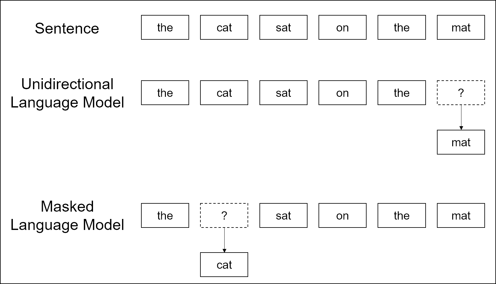

# BERT

- [BERT: Pre-training of Deep Bidirectional Transformers for Language Understanding](https://arxiv.org/abs/1810.04805)

- [TensorFlow code](https://github.com/google-research/bert)

- [PyTorch implementation](https://github.com/huggingface/pytorch-pretrained-BERT)

---

## Abstract

BERT: language representation model

Bidirectional Encoder Representations from Transformers

기존의 language representation model들과 달리, 모든 layer에서 왼쪽과 오른쪽의 context 모두를 jointly conditioning하여 deep bidirectional representation을 pre-train

pre-trained BERT representation을 사용하고 하나의 output layer만 fine-tuning하면 다양한 task에서 성능 향상 가능

## 1 Introduction

pre-trained language representation을 downstream task(질의응답, 감성 분석 같은 NLP task들)에 적용하기 위한 전략은 두 가지가 있었다.

- **feature-based**

    ELMo 등

    pre-trained representation을 추가 feature로 포함하는 task-specific architecture 사용

- **fine-tuning**

    OpenAI GPT(Generative Pre-trained Transformer) 등

    task-specific parameter를 최소화하고, downstream task 학습하면서 pre-trained parameter도 fine-tuning

feature-based와 fine-tuning 모두 pre-training 과정에서는 **unidirectional language model**을 사용하여 일반적인 language representation을 학습한다.

이 때 unidirectional language model을 사용하기 때문에 pre-trianing을 위한 구조의 선택이 제한적이다.

예를 들어, OpenAI GPT에서는 Transformer의 self-attention layer에서 각 token들이 이전 token에만 attend되는 left-to-right architecture를 사용하였다. 이 때문에 SQuAD question answering 같은 token-level task에 적용할 때 양방향의 문맥을 파악하기 어렵다는 문제를 보인다.

**BERT는 pre-trianing objective로 unidirectional language model이 아닌 masked language model로 사용한다.**

이에 따라 representation에 token 앞과 뒤의 문맥을 모두 반영할 수 있다.

더불어 next sentence prediction task를 통해 text-pair representation 학습

### contributions

- Language representation에서 bidirectional pre-training의 중요성을 보였다. BERT에서는 이를 위해 masked language model을 사용함
- sentence-level과 token-level 모두에서 복잡한 task-specific architecture보다 높은 성능 보임.

---

## 2 Related Work

pre-trianing general language representation의 역사

### 2.1 Feature-based Approaches

코퍼스로부터 다양한 목적으로 쓰일 수 있는 단어의 representation을 학습

- non-neural
- neural: Word2Vec, GloVe 등
- sentence embeddings: Skip-thought vectors 등
- paragraph embeddings: Doc2Vec 등
- ELMo: language model로부터 context-sensitive feature를 추출

### 2.2 Fine-tuning Approaches

language model objective로 model architecture를 pre-train한 이후, 같은 모델을 downstream task에서 fine-tuning

scratch로부터 학습되는 parameter들이 적다는 장점을 갖는다.

OpenAI GPT

### 2.3 Transfer Learning from Supervised Data

앞의 unsupervised pre-training과 달리 supervised task로부터 transfer하기도

---

## 3 BERT

### 3.1 Model Architecture

Multi-layer bidirectional Transformer encoder

Transformer 내용은 ["The Annotated Transformer"](http://nlp.seas.harvard.edu/2018/04/03/attention.html) 참고

notations:

$$ 2^t_0 $$