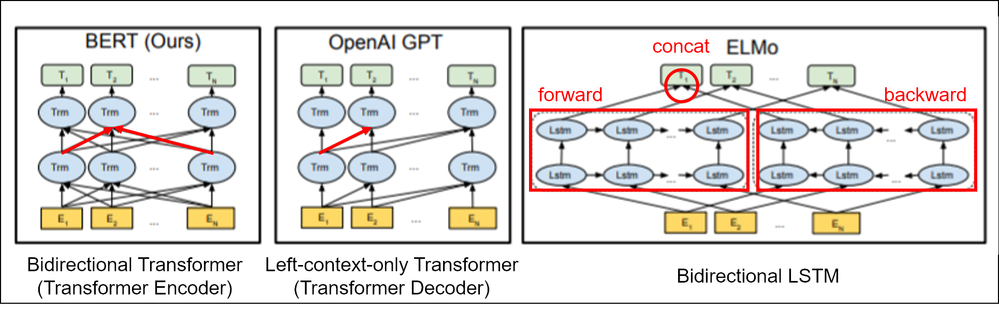
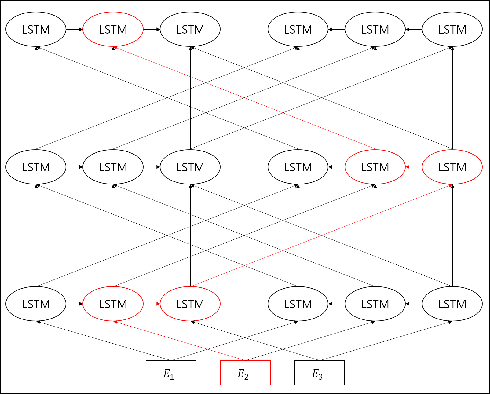
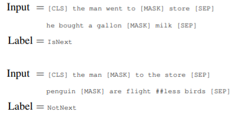

# BERT

- [BERT: Pre-training of Deep Bidirectional Transformers for Language Understanding](https://arxiv.org/abs/1810.04805)

- [TensorFlow code](https://github.com/google-research/bert)

- [PyTorch implementation](https://github.com/huggingface/pytorch-pretrained-BERT)

---

## Abstract

BERT: language representation model

Bidirectional Encoder Representations from Transformers

기존의 language representation model들과 달리, 모든 layer에서 왼쪽과 오른쪽의 context 모두를 jointly conditioning하여 deep bidirectional representation을 pre-train

pre-trained BERT representation을 사용하고 하나의 output layer만 fine-tuning하면 다양한 task에서 성능 향상 가능

## 1 Introduction

pre-trained language representation을 downstream task(질의응답, 감성 분석 같은 NLP task들)에 적용하기 위한 전략은 두 가지가 있었다.

- **feature-based**

    ELMo 등

    pre-trained representation을 추가 feature로 포함하는 task-specific architecture 사용

- **fine-tuning**

    OpenAI GPT(Generative Pre-trained Transformer) 등

    task-specific parameter를 최소화하고, downstream task 학습하면서 pre-trained parameter도 fine-tuning

feature-based와 fine-tuning 모두 pre-training 과정에서는 **unidirectional language model**을 사용하여 일반적인 language representation을 학습한다.

이 때 unidirectional language model을 사용하기 때문에 pre-trianing을 위한 구조의 선택이 제한적이다.

예를 들어, OpenAI GPT에서는 Transformer의 self-attention layer에서 각 token들이 이전 token에만 attend되는 left-to-right architecture를 사용하였다. 이 때문에 SQuAD question answering 같은 token-level task에 적용할 때 양방향의 문맥을 파악하기 어렵다는 문제를 보인다.

**BERT는 pre-trianing objective로 unidirectional language model이 아닌 masked language model로 사용한다.**

이에 따라 representation에 token 앞과 뒤의 문맥을 모두 반영할 수 있다.

더불어 next sentence prediction task를 통해 text-pair representation 학습

### contributions

- Language representation에서 bidirectional pre-training의 중요성을 보였다. BERT에서는 이를 위해 masked language model을 사용함
- sentence-level과 token-level 모두에서 복잡한 task-specific architecture보다 높은 성능 보임.

---

## 2 Related Work

pre-trianing general language representation의 역사

### 2.1 Feature-based Approaches

코퍼스로부터 다양한 목적으로 쓰일 수 있는 단어의 representation을 학습

- non-neural
- neural: Word2Vec, GloVe 등
- sentence embeddings: Skip-thought vectors 등
- paragraph embeddings: Doc2Vec 등
- ELMo: language model로부터 context-sensitive feature를 추출

### 2.2 Fine-tuning Approaches

language model objective로 model architecture를 pre-train한 이후, 같은 모델을 downstream task에서 fine-tuning

scratch로부터 학습되는 parameter들이 적다는 장점을 갖는다.

OpenAI GPT

### 2.3 Transfer Learning from Supervised Data

앞의 unsupervised pre-training과 달리 supervised task로부터 transfer하기도

---

## 3 BERT

### 3.1 Model Architecture

Multi-layer bidirectional Transformer encoder

Transformer 내용은 ["The Annotated Transformer"](http://nlp.seas.harvard.edu/2018/04/03/attention.html) 참고

- Transformer encoder: bidirectional Transformer
- Transformer decoder: left-context-only Transformer

(Figure 1에 메모 추가)

- BERT: left context와 right context를 jointly pre-train
- OpenAI GPT: left context만 반영 (every token can only attended to previous tokens)
- ELMo: left context와 right context를 따로 학습하여 concat

### 3.2 Input Representation

input representation에서 한 문장 또는 문장 pair를 표현할 수 있다.

각 token에 대한 input representation은 'token embedding + segment embedding + position embedding'

- token embedding: WordPiece embeddings
- segment embedding: sentence embedding
- position embedding: learned poitional embedding (?)

    (language model 학습 과정에서 학습되는 parameter?)

이 때 sequence의 첫 token은 항상 special classification embedding이다. classification task에서 sequence representation을 나타내기 위해 사용되고, classification task 아닌 경우에는 무시된다.

sentence pair에서 두 문장은 [SEP] token과 segment embedding으로 구분한다.

### 3.3 Pre-training Tasks

#### 3.3.1 Task #1: Masked LM

기존의 language model들은 단방향으로만 학습될 수 있었다. bidirectional conditioning은 multi-layered context에서 간접적으로 각 단어가 자기 자신의 영향을 받을 수 있기 때문.

(추측: left-context와 right-context가 분리되지 않을 경우 위와 같이 간접적으로 영향을 받는다는 것일지?)

**deep bidirectional representation 학습하기 위해 masked LM(MLM)을 사용한다.**

(입력 token들 중 일부를 가렸을 때 가린 token을 예측하는 language model)

mask token에 대응하는 final hidden vector가 output softmax 거쳐서 원래 단어를 예측하도록 한다.

- pre-training에서는 mask token 사용하지만 fine-tuning에는 mask token이 전혀 나타나지 않는 문제점

    masking에 항상 mask token을 사용하는 대신 일부에는 무작위 token이나 원래 token을 사용한다.

    - 80% mask token
    - 10% random word
    - 10% unchanged: 실제 word의 representation에 맞게 bias를 주기 위해서?

    이 때 encoder는 어떤 token을 예측해야 하는지 또는 어떤 token이 랜덤 token으로 대체되었는지 알 수 없으므로, 모든 input token에 대해 distributional contextual representation을 유지해야 한다.

- 각 batch에서 15%의 token만 가리고 예측하므로 left-to-right model보다 pre-training step이 더 많이 필요하다는 문제점

    left-to-right model은 앞의 token들로부터 이어질 token을 예측하므로, 코퍼스에서 나타나는 모든 token들을 예측한다. (즉, 예측 결과에 따른 model update 횟수가 더 많음)

    반면 masked language model은 masking한 15%의 token만을 예측하므로 pre-trianing step이 더 많이 필요하지만, 그만큼 더 좋은 성능을 보여준다.

#### 3.3.2 Task #2: Next Sentence Prediction

많은 downstream task에서는 문장 간 관계를 이해하는 것이 중요하다. (질의 응답 등) 이는 Task #1의 language modeling 만으로는 학습되지 않음.

50%는 실제 다음 문장, 50%는 랜덤 문장과 pair로 입력하여 실제 다음 문장인지 아닌지 구분하게 한다.

(논문 예시를 그대로 가져옴)

### 3.4 Pre-training Procedure

### 3.5 Fine-tuning Procedure

sequence-level classification에서는 [CLS] token에 대응하는 final hidden state로부터 classifier label들의 score 구하는 하나의 layer만 덧붙여서 fine-tuning

### 3.6 Comparison of BERT and OpenAI GPT

---

## 4 Experiments TODO